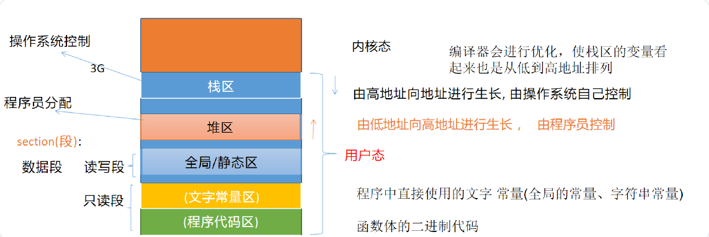

### Cppbase01

#### 0. 内存布局


- 栈区：操作系统控制，由高地址向低地址生长，编译器做了优化，显示地址时栈区和其他区域保持一致的方向。

- 堆区：程序员分配，由低地址向高地址生长，堆区与栈区没有明确的界限。

- 全局/静态区：读写段（数据段），存放全局变量、静态变量。

- 文字常量区：只读段，存放程序中直接使用的常量，如const char * p = "hello";  hello这个内容就存在文字常量区。

- 程序代码区：只读段，存放函数体的二进制代码。

#### 1. fmt/format.h
格式化输出库，可以格式化输出各种类型的数据，包括字符串、数字、指针、结构体、类等，但是不能格式化输出一个非 void 指针
```log
输出指针指向的值（解引用）：fmt::print("指针指向的值: {}\n", *ptr);    // 输出 ptr 指向的值
输出指针地址：fmt::print("指针地址: {}\n",static_cast<void*>(ptr));  // 输出 ptr 的地址
```

#### 2. 命名空间
命名空间就是一个可以由用户自己定义的作用域，在不同的作用域中可以定义相同名字的变量，互不干扰，系统能够区分它们。
使用方法：
```C++
using namespace std; //using编译指令

using std::cout;
using std::endl;
```
需要哪个实体的时候就引入到程序中，不需要的实体就不引入，可以尽可能减小犯错误的概率。

#### 3. const常量 - 必须初始化
[const常量和宏定义常量的区别]
1. 发生的时机不同：
C语言中的宏定义发生时机在预处理时，做字符串的替换；
const常量是在编译时（const常量本质还是一个变量，只是用const关键字限定之后，赋予只读属性，使用时依然是以变量的形式去使用）
2. 类型和安全检查不同：
宏定义没有类型，不做任何类型检查；
const常量有具体的类型，在编译期会执行类型检查。

[修饰指针类型*]

```C++
int number1 = 10;
int number2 = 20;

const int * p1 = &number1;//常量指针
*p1 = 100;//error 通过p1指针无法修改其所指内容的值
p1 = &numbers;//ok 可以改变p1指针的指向
int const * p2 = &number1; //常量指针的第二种写法

int * const p3 = &number1;//指针常量
*p3 = 100;//ok 通过p3指针可以修改其所指内容的值
p3 = &number2;//error 不可以改变p1指针的指向
const int * const p4 = &number1;//两者皆不能进行修改
```

#### 4. C/C++申请、释放堆空间的方式对比
```bash
# vim ~/.bashrc
# source ~/.bashrc 
# alias memcheck='valgrind --tool=memcheck --leak-check=full --show-reachable=yes'

valgrind --tool=memcheck --leak-check=full --show-reachable=yes ./bin/4_malloc
memcheck ./bin/4_malloc 
```

```log
==816204== Memcheck, a memory error detector
==816204== Copyright (C) 2002-2017, and GNU GPL'd, by Julian Seward et al.
==816204== Using Valgrind-3.18.1 and LibVEX; rerun with -h for copyright info
==816204== Command: ./bin/4_malloc
==816204== 
10
20
==816204== 
==816204== HEAP SUMMARY:
==816204==     in use at exit: 4 bytes in 1 blocks
==816204==   total heap usage: 4 allocs, 3 frees, 73,736 bytes allocated
==816204== 
==816204== 4 bytes in 1 blocks are definitely lost in loss record 1 of 1
==816204==    at 0x48657B8: operator new(unsigned long) (in /usr/libexec/valgrind/vgpreload_memcheck-arm64-linux.so)
==816204==    by 0x108B03: test1() (4_malloc.cc:15)
==816204==    by 0x108B5F: main (4_malloc.cc:23)
==816204== 
==816204== LEAK SUMMARY:
==816204==    definitely lost: 4 bytes in 1 blocks
==816204==    indirectly lost: 0 bytes in 0 blocks
==816204==      possibly lost: 0 bytes in 0 blocks
==816204==    still reachable: 0 bytes in 0 blocks
==816204==         suppressed: 0 bytes in 0 blocks
==816204== 
==816204== For lists of detected and suppressed errors, rerun with: -s
==816204== ERROR SUMMARY: 1 errors from 1 contexts (suppressed: 0 from 0)
```

[malloc/free和new/delete的区别]
1. malloc/free是库函数；new/delete是表达式，后两者使用时不是函数的写法；
2. new表达式的返回值是相应类型的指针，malloc返回值是void*；
3. malloc申请的空间不会进行初始化，获取到的空间是有脏数据的，但new表达式申请空间时可以直接初始化；
4. malloc的参数是字节数，new表达式不需要传递字节数，会根据相应类型自动获取空间大小。

C++11之后使用nullptr表示空指针
```C++
int* p = nullptr;
```

#### 5. 引用
在C++中，引用是一个已定义变量的别名。声明引用的同时，必须对引用进行初始化，否则编译时报错，此外引用一经绑定，无法更改绑定！

[面试-引用与指针的联系与区别*]
联系：
1. 引用和指针都有地址的概念，都是用来间接访问变量；
2. 引用的底层还是指针来完成，可以把引用视为一个受限制的指针。
区别：
1. 引用必须初始化，指针可以不初始化；
2. 引用不能修改绑定，但是指针可以修改指向；
3. 在代码层面对引用本身取址取到的是变量的地址，但是对指针取址取到的是指针变量本身的地址

引用作为函数参数：
参数传递的方式包括值传递、指针传递和引用传递。
采用值传递时，系统会在内存中开辟空间用来存储形参变量，并将实参变量的值拷贝给形参变量，即形参变量只是实参变量的副本而已；
如果函数传递的是类对象，而该对象占据的存储空间比较大，那发生复制就会造成较大的不必要开销。
这种情况下，强烈建议使用引用作为函数的形参，这样会大大提高函数的时空效率。
当用引用作为函数的参数时，其效果和用指针作为函数参数的效果相当。
当调用函数时，函数中的形参就会被当成实参变量或对象的一个别名来使用，也就是说此时函数中对形参的各种操作实际上是对实参本身进行操作，而非简单的将实参变量或对象的值拷贝给形参。

引用作为函数的返回值：
当以引用作为函数的返回值时，返回的变量其生命周期一定是要大于函数的生命周期的，即当函数执行完毕时，返回的变量还存在。
不要返回局部变量的引用，不要轻易返回一个堆空间变量的引用。

#### 6. 强制转换
[static_cast]，const_cast，dynamic_cast，reinterpret_cast

static_cast：用于基本数据类型之间的转换，如int转double，float转int等。//最常用
const_cast：用于去除常量性，将常量变量转化为非常量变量。
dynamic_cast：用于类之间的转换，主要用于多继承的情况。
reinterpret_cast：用于任意类型之间的转换。

目标类型 转换后的变量 = static_cast<目标类型>(要转换的变量)
好处：不允许非法的转换发生；方便查找

#### 7. 函数重载
C++ 允许多个函数拥有相同的名字，只要它们的参数列表不同就可以，这就是函数重载（Function Overloading）。
借助重载，一个函数名可以有多种用途。
函数重载是指在同一作用域内，可以有一组具有相同函数名，不同参数列表的函数，这组函数被称为重载函数。
重载函数通常用来命名一组功能相似的函数，这样做减少了函数名的数量，对于程序的可读性有很大的好处。

[实现函数重载的条件]
函数参数的数量、类型、顺序任一不同则可以构成重载。

[默认参数]
C++可以给函数定义默认参数值。通常，调用函数时，要为函数的每个参数给定对应的实参。
函数给了默认参数之后就可以进行缺省调用，但是传入的参数优先级高于默认参数。
通常是将默认值的设置放在声明中而不是定义，如果在声明中和定义中都传了默认值，会报错。

如果一个函数中有多个默认参数，则形参分布中，默认参数应从右至左逐渐定义。当调用函数时，只能从右向左匹配参数。如：

```C++
void func2(int a = 1, int b, int c = 0, int d);//error
void func2(int a, int b, int c = 0, int d = 0);//ok
```

定义函数时，在函数的最前面以关键字“inline”声明函数，该函数即可称为内联函数（内联声明函数）。

```C++
inline int max(int x, y)
{
	return x > y ? x : y;
}
```
inline函数在头文件必须有定义，否则编译器无法识别。


